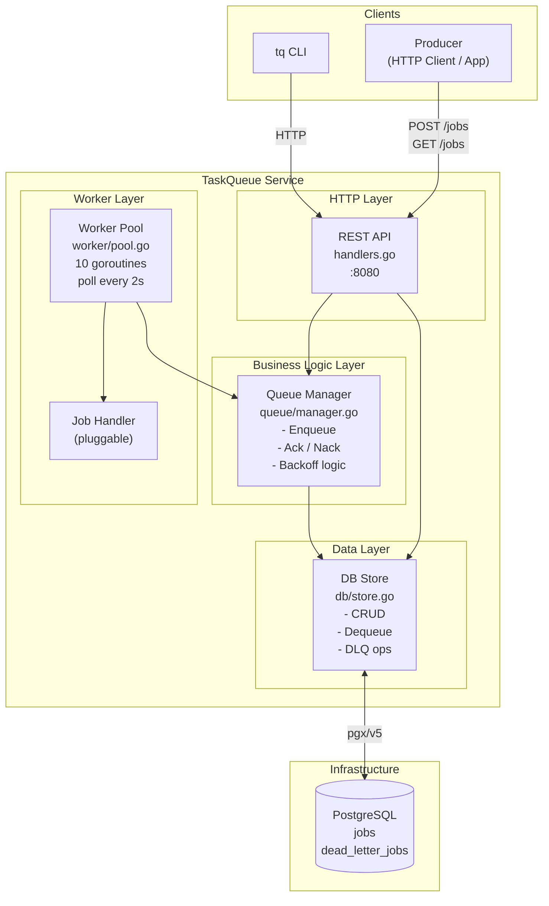
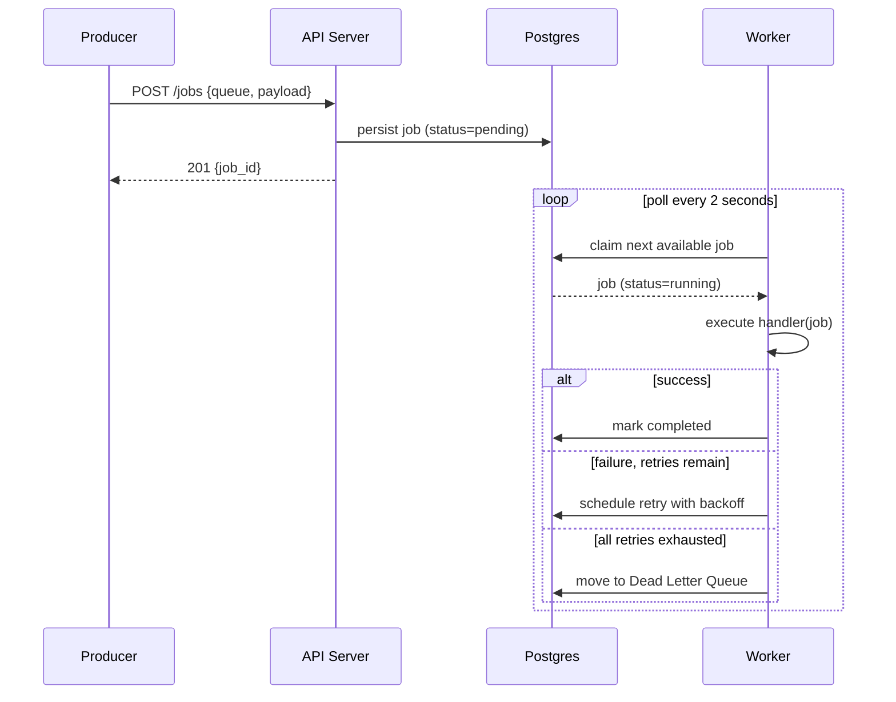
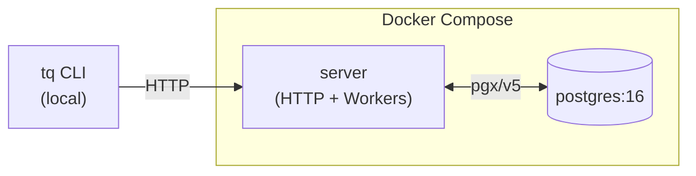

# High-Level Design — TaskQueue

## What it is

TaskQueue is a distributed background job processing system modelled after Amazon SQS. Clients submit work over HTTP; a pool of goroutine workers picks up and executes jobs concurrently; failed jobs are retried with exponential backoff; jobs that exhaust all retries land in a Dead Letter Queue.

---

## Service Architecture

Shows all major layers and how they relate to each other.

---

## Request Flow

End-to-end journey of a job from submission to completion.

---

## Deployment View

---

## Key Design Decisions

| Decision | Rationale |
|---|---|
| Postgres as the queue backend | Durable, ACID transactions, no extra infrastructure needed |
| Atomic dequeue with row-level locking | Prevents double-delivery under concurrent workers — see LLD for mechanics |
| Polling over push | Simpler, portable; poll interval is tunable per deployment |
| Workers embedded in server process | Reduces operational complexity for a single-node deployment |
| Exponential backoff with a cap | Avoids hammering a broken downstream — see LLD for exact values |
| Dead Letter Queue | Failed jobs are never silently dropped; always recoverable via requeue |
