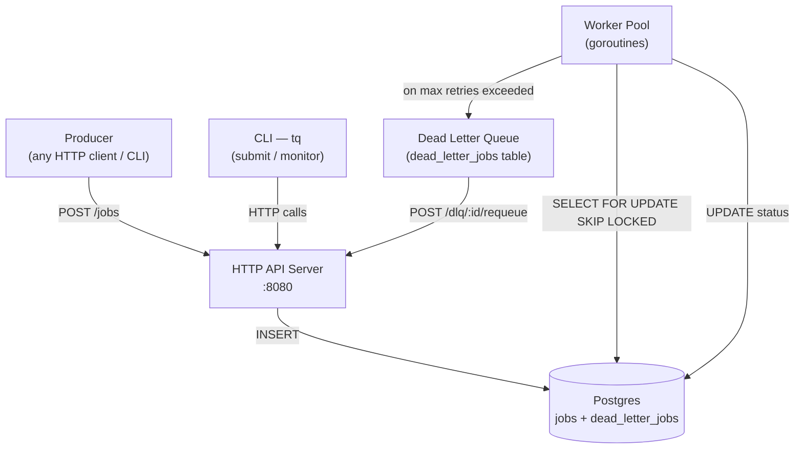
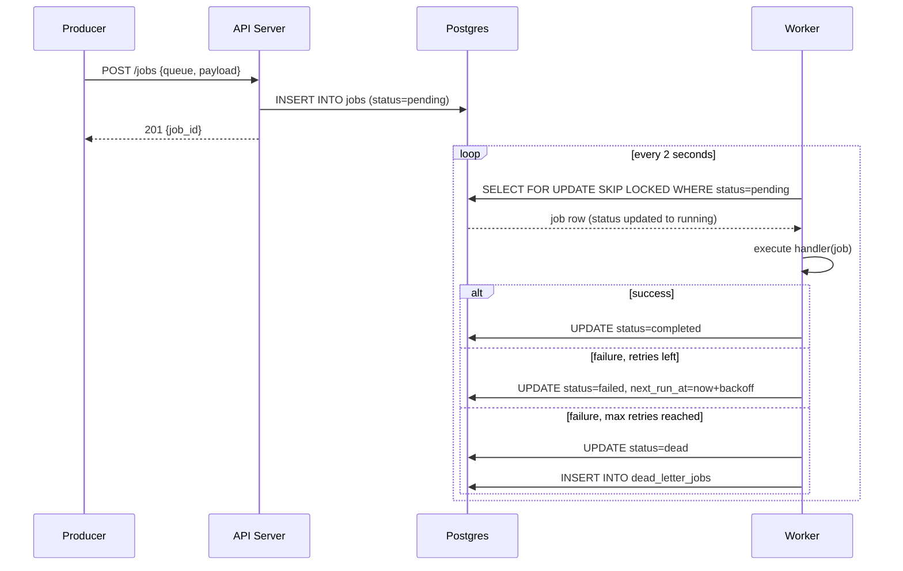
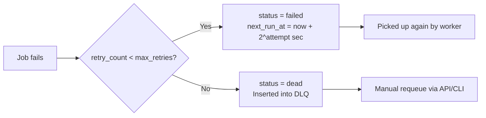
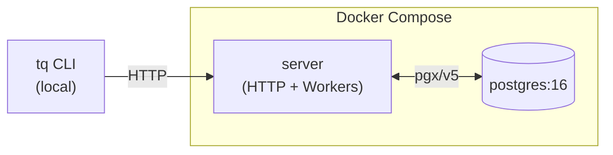

# High-Level Design — TaskQueue

## What it is

TaskQueue is a distributed background job processing system modelled after Amazon SQS. Clients submit work over HTTP; a pool of goroutine workers picks up and executes jobs concurrently; failed jobs are retried with exponential backoff; jobs that exhaust all retries land in a Dead Letter Queue.

---

## System Components

---

## Request Flow

---

## Retry & Backoff Strategy

---

## Deployment View

---

## Key Design Decisions

| Decision | Rationale |
|---|---|
| Postgres as the queue backend | Durable, ACID transactions, no extra infrastructure |
| `SELECT FOR UPDATE SKIP LOCKED` | Prevents double-delivery under concurrent workers with no application-level locking |
| Polling (not LISTEN/NOTIFY) | Simpler, portable; poll interval is tunable |
| Workers embedded in server process | Reduces operational complexity for a single-node deployment |
| Exponential backoff capped at 1 hour | Avoids hammering a broken downstream while still retrying |
