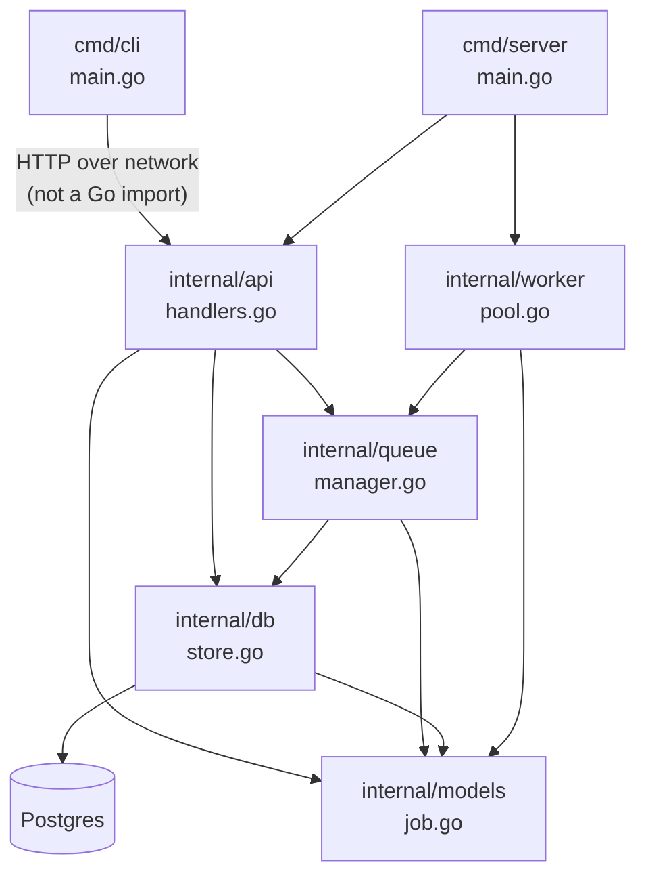
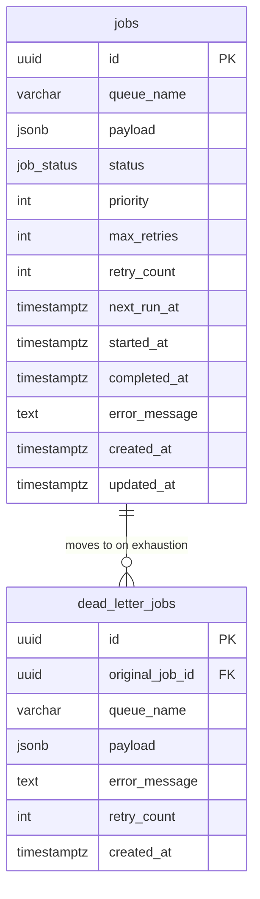
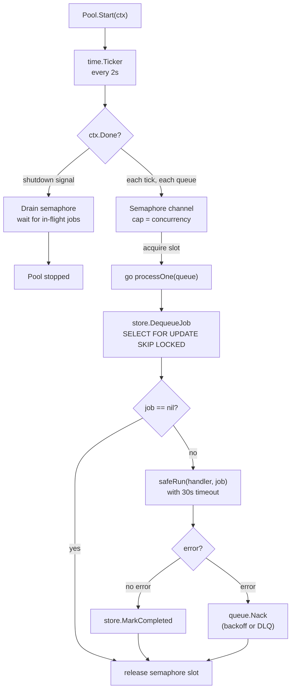
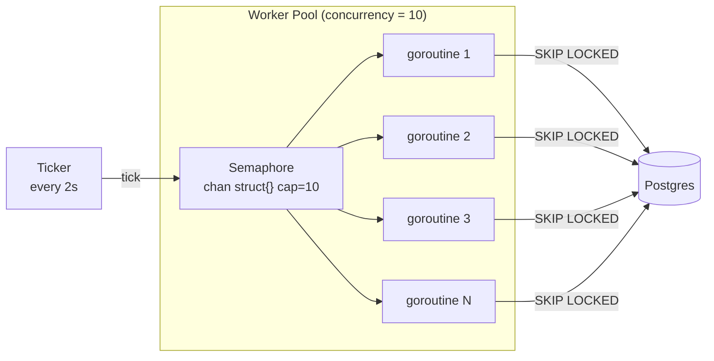
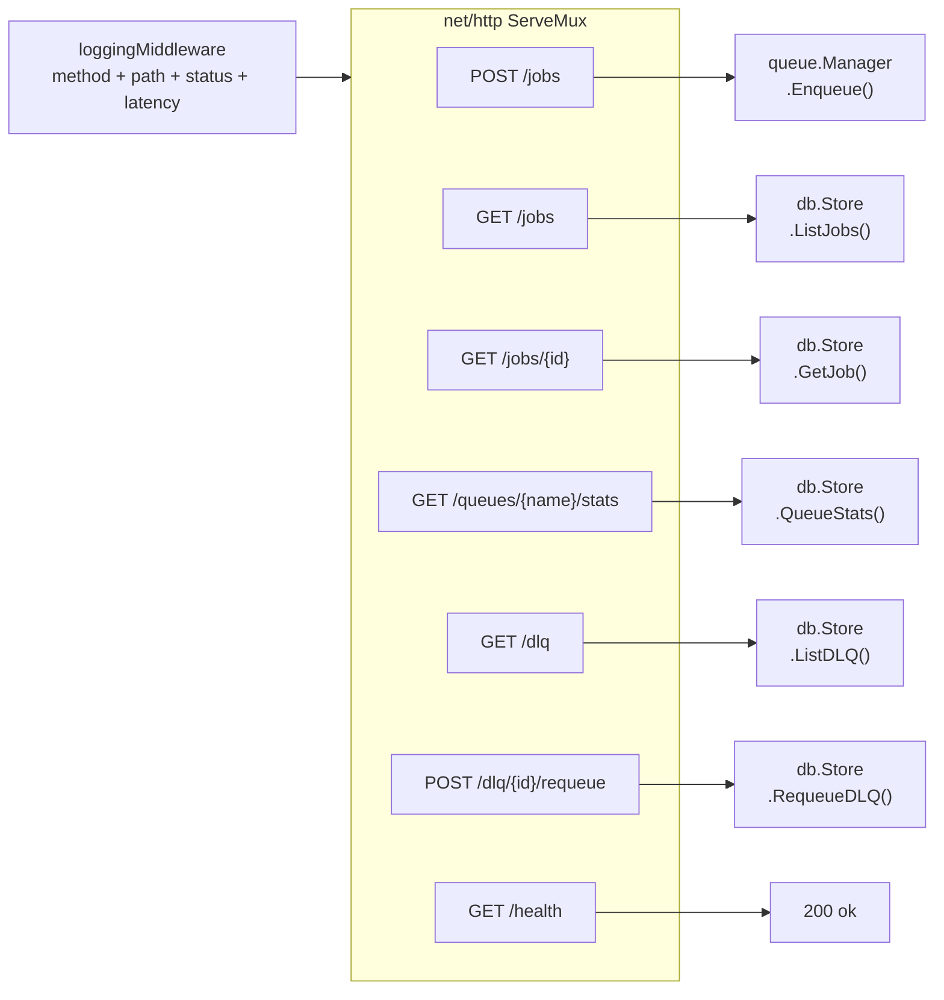
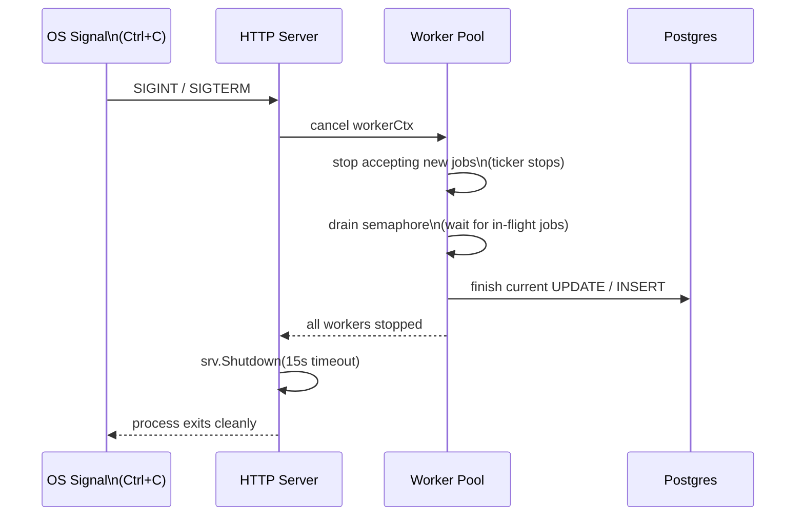

# Low-Level Design — TaskQueue

## Package Dependency Graph

---

## Database Schema

### DB Indexes

| Index | Columns | Purpose |
|---|---|---|
| `idx_jobs_queue_status_next_run` | `queue_name, status, priority DESC, next_run_at` | Fast dequeue — partial index on `status = pending` |
| `idx_jobs_status` | `status` | Fast filtering in list/stats queries |
| `idx_dlq_queue` | `queue_name` | Fast DLQ listing per queue |
| `idx_dlq_original` | `original_job_id` | Look up DLQ entry by original job |

---

## Worker Pool Internals

---

## Concurrency Model

Each tick spawns one goroutine per queue. The semaphore ensures at most `concurrency` goroutines run simultaneously. `SKIP LOCKED` ensures no two goroutines pick the same job.

---

## API Layer

---

## CLI → API Mapping

| CLI command | HTTP call |
|---|---|
| `tq submit -q <q> -p <json>` | `POST /jobs` |
| `tq status <id>` | `GET /jobs/<id>` |
| `tq list --queue --status` | `GET /jobs?queue=&status=` |
| `tq stats --queue <q>` | `GET /queues/<q>/stats` |
| `tq dlq list` | `GET /dlq` |
| `tq dlq requeue <id>` | `POST /dlq/<id>/requeue` |

---

## Retry Backoff Values

| Attempt | Delay before next retry |
|---|---|
| 1st failure | 2 seconds |
| 2nd failure | 4 seconds |
| 3rd failure | 8 seconds |
| 4th failure | 16 seconds |
| 5th failure | 32 seconds |
| 6th failure | 64 seconds |
| 7th failure | 128 seconds |
| 8th failure | 256 seconds |
| 9th failure | 512 seconds |
| 10th failure | 1024 seconds |
| 11th failure | 2048 seconds |
| **> 11 attempts** | capped at **1 hour** |

---

## Graceful Shutdown Sequence

