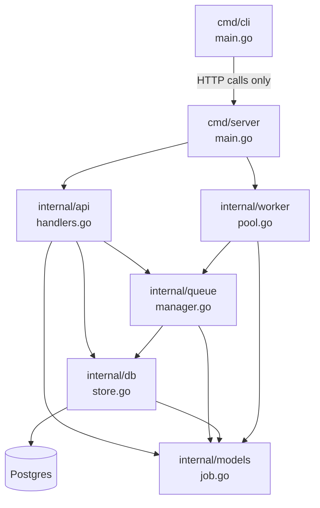
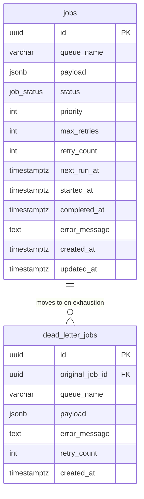
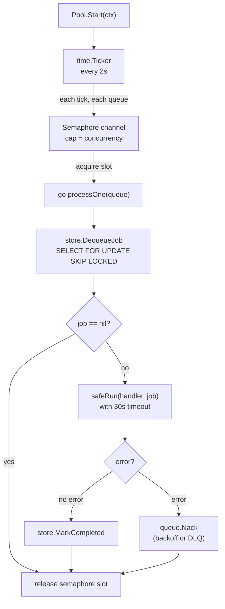
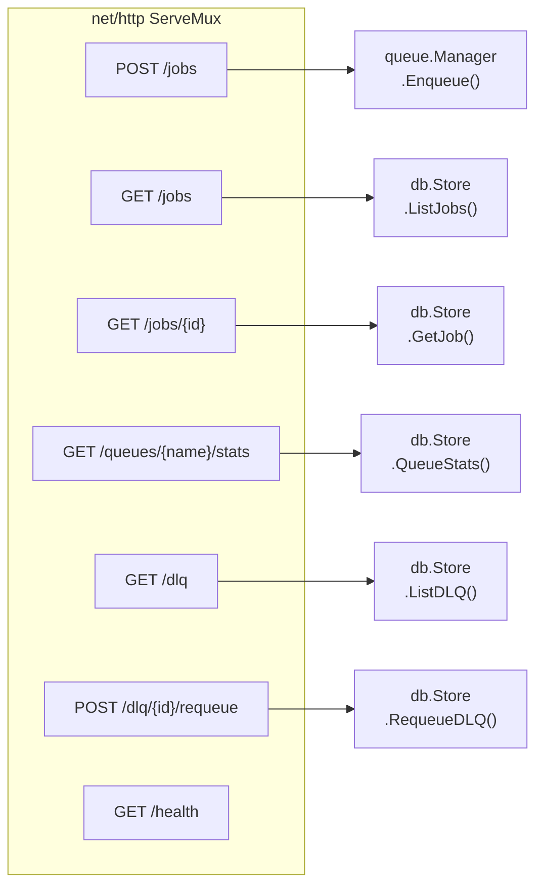
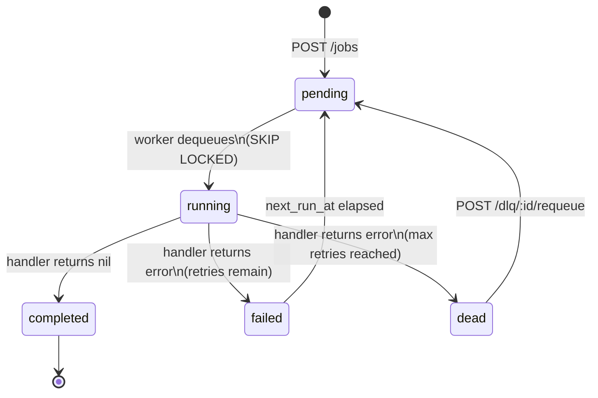

# Low-Level Design — TaskQueue

## Package Dependency Graph

---

## Database Schema

---

## Worker Pool Internals

---

## API Layer

---

## CLI → API Mapping

| CLI command | HTTP call |
|---|---|
| `tq submit -q <q> -p <json>` | `POST /jobs` |
| `tq status <id>` | `GET /jobs/<id>` |
| `tq list --queue --status` | `GET /jobs?queue=&status=` |
| `tq stats --queue <q>` | `GET /queues/<q>/stats` |
| `tq dlq list` | `GET /dlq` |
| `tq dlq requeue <id>` | `POST /dlq/<id>/requeue` |

---

## Job Status Transitions

---

## Retry Backoff Values

| Attempt | Delay before next retry |
|---|---|
| 1st failure | 2 seconds |
| 2nd failure | 4 seconds |
| 3rd failure | 8 seconds |
| 4th failure | 16 seconds |
| 5th failure | 32 seconds |
| … | … (doubles each time) |
| > ~36 attempts | capped at **1 hour** |
